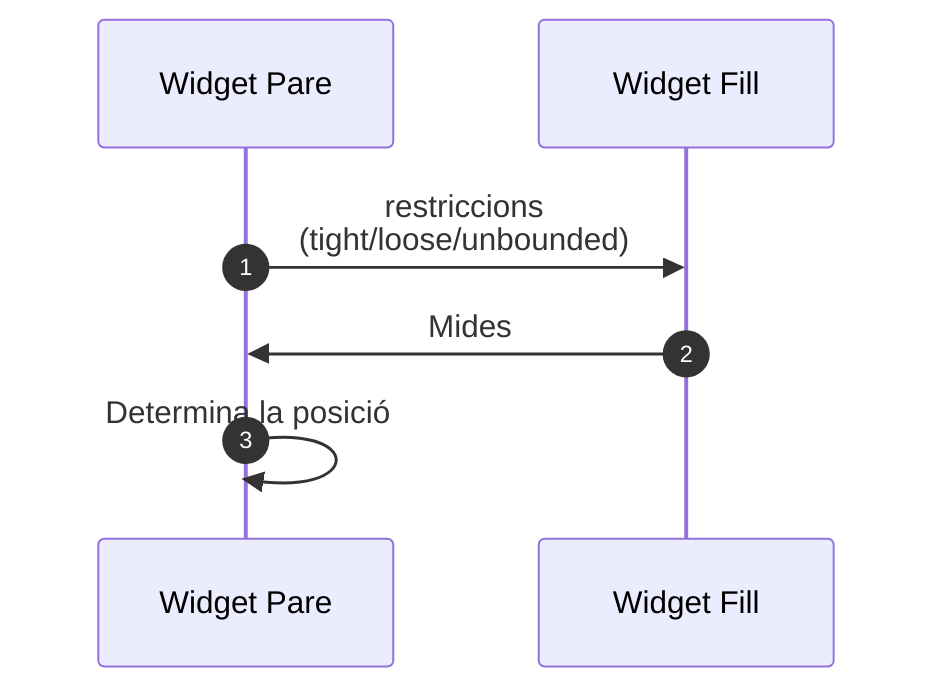
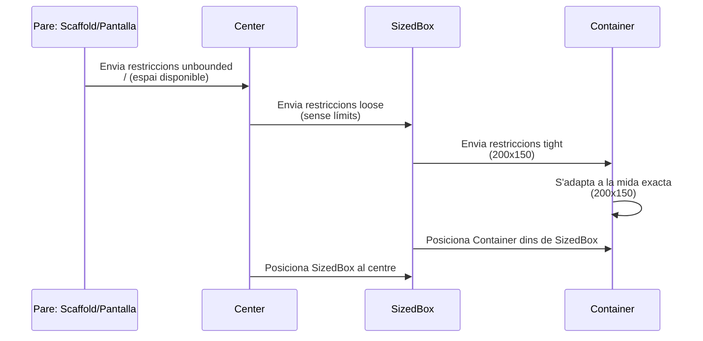

# Fonaments de disseny en Flutter: Layouts

En Flutter el sistema de layouts és qui determina l'organització dels ginys i s'encarrega de mostrar-los correctament a la pantalla. Flutter utilitza un sistema basat en **restriccions** (constraints), on el widget pare envia restriccions als seus fills, els quals decideixen la seua mida dins d'aquestes restriccions. Després, el pare decideix on col·locar-los dins del seu espai.

## Les tres regles bàsiques del layout a Flutter

Quan es parla de [disseny amb Flutter]((https://docs.flutter.dev/ui/layout/constraints)) hi ha una constant que sol repetir-se bastant:

> *Constraints go down. Sizes go up. Parent sets position.*

Aquesta ve a reflexar les tres regles o fases fonamentals dels layouts en Flutte:

1. **Les restriccions baixen (Constraints go down)**: El pare envia les restriccions als fills. Aquestes restriccions defineixen les mides mínimes i màximes en què els fills poden ocupar espai.
2. **Les mides pugen (Sizes go up)**: Els fills decideixen la seua mida dins d'aquestes restriccions i la passen al pare.
3. **El pare col·loca el fill (Parent sets position)**: Una vegada el fill ha triat la seua mida, el pare decideix on col·locar-lo dins del seu espai disponible.

## Tipus de restriccions: **Tight**, **Loose**, i **Unbounded**

Quan el pare envia les restriccions als fills, aquestes poden ser de diversos tipus. Aquests tipus de restriccions ens ajuden a entendre com es comporten els ginys a Flutter:

| Tipus de restricció | Descripció                                                          | Exemple                                             |
| ------------------- | ------------------------------------------------------------------- | --------------------------------------------------- |
| **Tight**           | El pare força una mida exacta.                                      | `SizedBox(width: 200, height: 150)`                 |
| **Loose**           | El pare permet que el fill decidisca dins d'un rang.                | `Center(child: Container(width: 100, height: 100))` |
| **Unbounded**       | El pare no posa límits, i permet que el fill cresca tant com vulga. | `ListView(children: [...])`                         |

Veiem aquest flux de manera esquemàtica:



## Com es comporten els widgets amb les restriccions?

Els widgets de Flutter gestionen les restriccions de manera diferent segons el seu tipus i la seua funció. Veiem alguns dels comportaments més comuns:

### **Ginys que envien restriccions tight**

* **`SizedBox(width, height)`**: Força la mida exacta per als seus fills.
* **`Container(width, height)`**: Si es defineixen les mides, força la mida del fill.

### **Ginys que envien restriccions loose**

* **`Center`**: Envia restriccions de tipus **loose** als seus fills. Els fills poden decidir la mida dins de l'espai disponible, però **Center** els col·locarà al centre.
* **`Align`**: Similar a `Center`, però permet més control sobre l'alineació del fill dins de l'espai.

### **Ginys que envien restriccions unbounded**

* **`ListView` i `SingleChildScrollView`**: Envia restriccions **unbounded** en la direcció de l'**scroll**, i permeten que els fills cresquen sense límit en aquesta direcció.

## Exemples pràctics de diferents tipus de restriccions

Veiem alguns exemples de tot el que hem parlat. Però abans d'això anem a introduir un nou widget: el `LayoutBuilder`.

#### LayoutBuilder

El [`LayoutBuilder`]((https://api.flutter.dev/flutter/widgets/LayoutBuilder-class.html) ) és un giny molt útil que ens permet accedir a les restriccions d'espai que rep un widget dins del layout. A través del seu paràmetre `constraints`, podem veure les mides disponibles per al nostre widget en cada direcció, i decidir com adaptar-nos a elles.

En els següents exemples, farem ús d'aquest `LayoutBuilder` per mostrar les diferents restriccions i veure com aquestes es propaguen entre els giny. Aquest widget s'usa de la següent manera:

```dart
LayoutBuilder(
     builder: (BuildContext context, BoxConstraints constraints) {
      debugPrint('Constraints rebudes: $constraints');
                return ... // Aci afegim el widget en qüestió
            },
        );
 ```

Com veiem, aquest gint té un argument amb nom `builder` que és una funció. Aquesta funció rep el context i un paràmetre `BoxConstraints constraints`, amb les restriccions proporcionades pel widget pare, i retorna un *widget*, amb el contingut.

#### Píxels lògics i físics

Quan especifiquem les dimensions per als diferents widgets ho farem amb el que es coneixen com *píxels lògics*. És important entendre la distinció entre aquests píxels lògics i els píxels físics.
    
- **Píxels lògics**: Són la unitat de mesura independent del dispositiu. Flutter utilitza aquesta unitat per garantir que les dimensions siguen consistents a totes les plataformes. Els *píxels lògics* són independents de la densitat de píxels del dispositiu, és a dir, els píxels lògics no varien si estem a un dispositiu amb pantalla d'alta resolució o baixa resolució.
    
- **Píxels físics**: Es refereixen als píxels reals de la pantalla del dispositiu, que poden variar segons la *densitat de píxels* (DPI). Els dispositius amb pantalles de major resolució tindran més píxels físics per cada píxel lògic.

En apartats posteriors de la unitat reprendrem aquestes mesures, i veurem com obtindre també la mida física d'un dispositiu i la relació entre píxels lògics i físcis.

### Exemple 1: *Loose* amb `Center` i *Tight* amb `SizedBox`

```dart
Center(
  child: SizedBox(
    width: 200,
    height: 150,
    child: Container(color: Colors.blue),
  ),
)
```

* **El `Center`** envia restriccions **looses** al **`SizedBox`**, el que vol dir que permet que aquest es dimensione dins de l'espai disponible. Però com que el **`Center`** no defineix cap restricció específica, transmet les restriccions del seu pare (per exemple l'*Scaffold*), transformant-les en *loose* cap als seus fills. 
* **El `SizedBox`** estableix una mida fixa (200×150) per al seu fill. Això vol dir que el **`SizedBox`** envia una restricció **tight** de 200×150 al **`Container`**, que no pot modificar la seua mida. El **`Container`** s'adapta a la mida exacta que li ha assignat el seu pare (**`SizedBox`**).
* **El `SizedBox`** decideix la posició del **`Container`** dins de l'espai que li ha estat assignat. Com que el **`SizedBox`** ja té dimensions definides, el seu fill (**`Container`**) ocuparà exactament 200×150 px dins de l'espai proporcionat.
* **El `Center`** decideix la posició del **`SizedBox`**, centrant-lo dins de l'espai disponible.

Visualment, podriem vore-ho de la següent manera:



**Visualitzant les restriccions**

Si adaptem aquest exemple i afegim un parell de `LayoutBuilders` per consultar les *constraints*:

```dart
body: Center(
    child: LayoutBuilder(
        builder: (BuildContext context, BoxConstraints constraints) {
            debugPrint('Límit de mides que rep SizedBox: $constraints');
            return SizedBox(
            width: 200,
            height: 150,
            child: LayoutBuilder(
                builder: (BuildContext context, BoxConstraints constraints) {
                debugPrint(
                    'Límit de mides que rep Container: $constraints',
                );
                return Container(color: Colors.blue);
                },
            ),
            );
        },
    ),
),
```

El que se'ns mostrarà per la terminal serà:

```
Límit de mides que rep SizedBox: BoxConstraints(0.0<=w<=411.4, 0.0<=h<=834.3)
Límit de mides que rep Container: BoxConstraints(w=200.0, h=150.0)
```

Aci podem apreciar com el `SizedBox` el que acaba rebent són les restriccions *loose* de l'`Scaffold` (ample entre 0 i 411.4 i alt entre 0 i 834.3), mentre que el `Container` rep les restriccions *tight* proporcionades pel `SizedBox`.


### Exemple 2: *Loose* amb `Center`, especificant restriccions

En l'exempel anterior, el `Center`, tot i enviar restriccions *loose*, com que no les especifica, transmet les del seu pare (*Scaffold*). Si volguerem que aquest `Center` especificara les restriccions, fariem ús del widget `ConstrainedBox`, de la següent manera:


```dart
Center(
  child: ConstrainedBox(
    constraints: BoxConstraints(
      minWidth: 50,
      minHeight: 50,
      maxWidth: 300,
      maxHeight: 300,
    ),
    child: SizedBox(
      width: 200,
      height: 150,
      child: Container(color: Colors.blue),
    ),
  ),
),        
```

En aquest cas, el `Center` estebleix unes restriccions per al fill a través del `ConstraindedBox`, amb unes dimensions mínimes de 50 d'ample per 50 d'alçada i màximes de 300 d'ample per 300 d'alçada. Per tant, el `SizedBox` podria establir qualsevol mida  dins d'aquests límits.

Si afegim els `LayoutBuilders` com abans, veurem que les dimensions que es mostren ara són:

```
I/flutter (11512): Límit de mides que rep SizedBox: BoxConstraints(50.0<=w<=300.0, 50.0<=h<=300.0)
I/flutter (11512): Límit de mides que rep Container: BoxConstraints(w=200.0, h=150.0)
```

### Exemple3: *Unbounded Constraints* amb `ListView`

Veiem altre exemple, ara amb restriccions sense límits amb un `ListView`:

```dart
ListView(
  children: [
    Container(color: Colors.red, height: 100),
    Container(color: Colors.green, height: 150),
    Container(color: Colors.blue, height: 200),
  ],
)
```

* El **`ListView`** envia restriccions **unbounded** en la direcció de scroll (de manera predeterminada, *vertical*).
* Els **`Container`** poden créixer tant com vulguen en la direcció de scroll, però l'espai en l'altra direcció es limitarà per les mides que el pare defineix (per exemple l'*Scaffold*)

Si incorporem els *LayoutBuilders* per veure les dimensions, com hem fet als exemples anteriors <!-- Afetfir: Consultar el codi font i enllaçar a github... -->, veurem que l'eixida per consola és:

```
Límit de mides que rep ListView: BoxConstraints(0.0<=w<=411.4, 0.0<=h<=834.3)
Límit de mides del primer Contenidor: BoxConstraints(w=411.4, 0.0<=h<=Infinity)
Límit de mides del segon Contenidor: BoxConstraints(w=411.4, 0.0<=h<=Infinity)
Límit de mides del terccer Contenidor: BoxConstraints(w=411.4, 0.0<=h<=Infinity)
```

Com podem apreciar, l'ample és l'establert per l'*Scaffold*, mentre que l'alçada és *Infinity*, el que vol dir que pot prendr equalsevol valor.

## Errors comuns i solucions

### **Overflow**

Quan un fill intenta créixer més del que el pare permet, es produeix un error d'**overflow** (desbordament). Flutter mostra una línia negra i groga per indicar-ho.

* **Exemple 4: Overflow vertical en `Column`**

```dart
Column(
  children: [
    Container(color: Colors.red, height: 300),
    Container(color: Colors.green, height: 500),
  ],
)
```

En aquest exemple, el `Column` no aplica cap tipus de restriccions màximes, pel que quan el segon fill intenta créixer més de la mida possible, provoca un desbordament o *overflow*.

Si depurem incorporant alguns `LayoutBuilder`, veurem el següent:

```
Límit de mides que rep Column: BoxConstraints(0.0<=w<=411.4, 0.0<=h<=834.3)
Límit de mides que rep el Container roig: BoxConstraints(0.0<=w<=411.4, 0.0<=h<=Infinity)
Límit de mides que rep El Container verd: BoxConstraints(0.0<=w<=411.4, 0.0<=h<=Infinity)
```

En aquesta eixida es mostra com el `Column` sí que rep restriccions del seu pare (`Scaffold`), però els fills no tenen cap restricció d'alçada màxima, i pe això es produeix el desbordament.

La diferència amb l'exemple del `SizedBox`, és que aquest sí que aplica restriccions de mida màximes, pel que els fills, encara que vulguen créixer més, s'ajusten a aquestes restriccions.

Aci podem aplicar dues solucions, una amb `Expanded` i altra amb `SingleChildScrollView`.

#### Solució a l'Overflow amb `Expanded`

Amb **`Expanded`** permetem que els fills ompliguen l'espai disponible. Per exemple, si en lloc d'afegir una alçada concreta al contenidor verd, l'afegim dins un `Expanded`:

```dart
Column(
  children: [
    Container(color: Colors.red, height: 300),
    Expanded(child: Container(color: Colors.green)),
  ],
)
```

En aquest cas, si apliquem *LayoutBuilders* per vore les restriccions:

```Límit de mides que rep Column: BoxConstraints(0.0<=w<=411.4, 0.0<=h<=834.3)
Límit de mides que rep Container roig: BoxConstraints(0.0<=w<=411.4, 0.0<=h<=Infinity)
Límit de mides que rep Container verd: BoxConstraints(0.0<=w<=411.4, h=534.3)
```

Com veiem, l'`Expanded` li aplica restriccions màximes al contenidor verd, que és l'espai restant que li queda al `Column` (que té *h<=834.3*), després d'afegir el contenidor roig (834.3-300=534.3).

#### Solució a l'Overflow amb `SingleChildScrollView`

Altra solució és envoltar el `Column` amb un giny `SingleChildScrollView`, de manera que s'aplique un scroll en cas d'excedir les dimensions del Column.

```dart
SingleChildScrollView(
child: Column(
    children: [
      Container(color: Colors.red, height: 300),
      Container(color: Colors.green, height: 500),
    ],
  )
)
```

Ara, el `SingleChildScrollView` rep les restriccions de la *pantalla*/*Scaffold*, però li proporciona una alçada infinita al Column, pel que els seus fills poden créixer tant com desitgen.

```
Límit de mides que rep SingleChildSrollView: BoxConstraints(0.0<=w<=411.4, 0.0<=h<=834.3)
Límit de mides que rep Column: BoxConstraints(0.0<=w<=411.4, 0.0<=h<=Infinity)
Límit de mides que rep el Container roig: BoxConstraints(0.0<=w<=411.4, 0.0<=h<=Infinity)
Límit de mides que rep El Container verd: BoxConstraints(0.0<=w<=411.4, 0.0<=h<=Infinity)
```

### **Unbounded Height Error**

En alguns casos, un widget que rep restriccions **unbounded** no sap com calcular la mida, especialment quan s'usa dins un **scroll**.

Per exemple:

```dart
Column(
  children: [
    Text("Text de capçalera"),
    ListView(
      children: [
        Container(color: Colors.red, height: 100),
        Container(color: Colors.green, height: 150),
        Container(color: Colors.blue, height: 200),
      ],
    ),
  ],
)
```

Aci, el `Column` no té una alçada fixa, i el `ListView` no sap quina alçada ha de tindre. Aleshores, Flutter donarà un error d'*unbounded height*, perquè `ListView` no pot calcular correctament la mida per al seu renderitzat. Concretament:


```
══╡ EXCEPTION CAUGHT BY RENDERING LIBRARY ╞═════════════════════════════════════════════════════════
The following assertion was thrown during performResize():
Vertical viewport was given unbounded height.
Viewports expand in the scrolling direction to fill their container. In this case, a vertical
viewport was given an unlimited amount of vertical space in which to expand. This situation
typically happens when a scrollable widget is nested inside another scrollable widget.
If this widget is always nested in a scrollable widget there is no need to use a viewport because
there will always be enough vertical space for the children. In this case, consider using a Column
or Wrap instead. Otherwise, consider using a CustomScrollView to concatenate arbitrary slivers into
a single scrollable.
```

En aquest cas, la solució passa per afegir un **`ConstrainedBox`** o utilitzar **`Expanded`** per evitar mides *unbounded* no desitjades.


